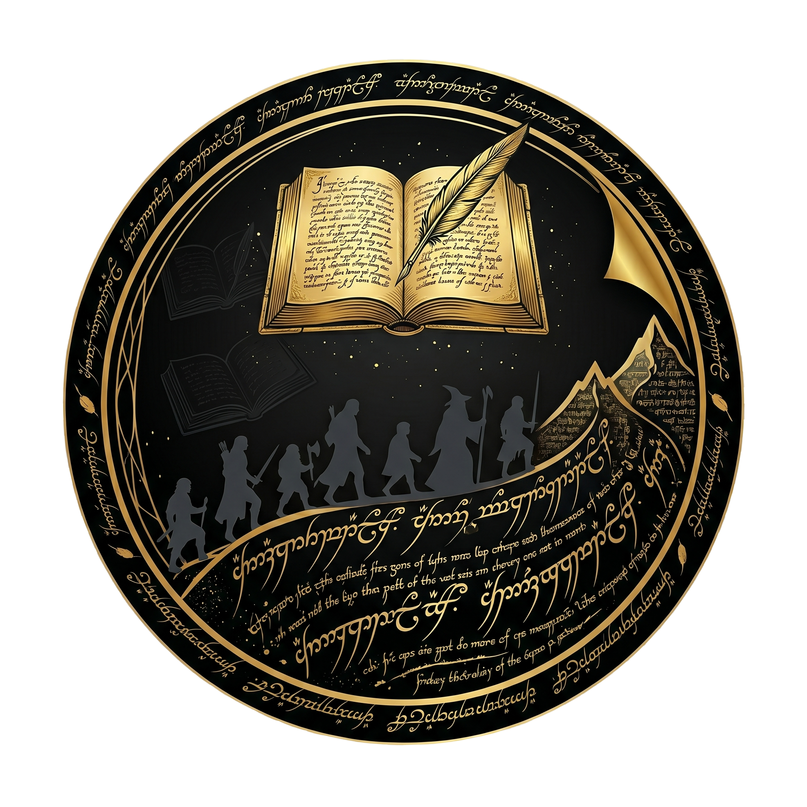

# The Fellowship of the Script


*Banner generated using Google Gemini.*

An interactive data visualization exploring dialogue, movement, and character relationships across Peter Jackson's *The Lord of the Rings* trilogy. Built with D3.js and vanilla JavaScript.

**[View Live Application](https://the-fellowship-of-the-script.vercel.app/)** &nbsp;|&nbsp; **[View Documentation](https://matthewgoldsberry.github.io/portfolio/projects/the-fellowship-of-the-script/)**

---

## Features

- **Scene Timeline** - scrub or animate through all 96 scenes across the trilogy. With the ability to watch character icons update on the Middle-earth map as the story progresses
- **Character Movement Paths** - color-coded travel routes that accumulate across scenes
- **Scene Info Panel** - scene thumbnail, film, summary, stat pills (lines / characters / fellowship count), speaking-character bar chart, and full scene transcript
- **Character Info Panel** - portrait, wiki link, stat pills, description, scene-presence heatmap, top phrases, and top words
- **Scene Co-occurrence Chord** - D3 chord diagram showing how often each pair of fellowship members share scenes
- **Fellowship Lines Chart** - horizontal bar chart of total dialogue lines per character
- **"Play Scene" animation** - steps through each line of dialogue in a scene, placing speech bubbles on the map next to the speaking character's icon

---

## Stack

- **D3.js v6** - chord diagram, bar charts, SVG path drawing, and scene animations
- **Vanilla HTML/CSS/JS** - no framework or build step required
- **Python** - data preprocessing and CSV generation

---

## Project Structure

```plaintext
Movie-Time/
├── index.html                  # Single-page application shell
├── css/
│   └── style.css               # All styles
├── js/
│   ├── main.js                 # Data loading, aggregation, global state, event wiring
│   ├── InfoPanel.js            # InfoPanel class - scene and character panel rendering
│   ├── SceneSlider.js          # Timeline slider, scene dropdown sync + play animation
│   ├── MakerPlacer.js          # Character icon markers and movement path drawing
│   ├── ScenePlayer.js          # "Play Scene" dialogue animation
│   ├── CharacterChord.js       # D3 chord co-occurrence diagram
│   ├── HorizontalBarChart.js   # Reusable horizontal bar chart (lines, words, phrases)
│   ├── CharacterPresence.js    # Scene-presence heatmap
│   ├── CharacterPhrases.js     # Top n-gram phrase extraction and rendering
│   ├── d3.layout.cloud.js      # D3 word cloud package
│   └── d3.v6.min.js            # D3 package
├── data/
│   ├── lotr_script_data.csv    # Dialogue info: scene, character, dialogue, location
│   ├── images/
│   │   ├── characters/         # Fellowship portrait PNGs (frodo.png, ..., boromir.png)
│   │   ├── scenes/             # Scene thumbnail PNGs (0.png, ..., 95.png)
│   │   └── Middle_Earth_….png  # Map background
│   └── font/
│       └── tngan.ttf           # Tengwar Annatar font (ring inscription)
└── README.md
```

---

## Running Locally

The app is static and will need to be hosted by an HTTP server.

```bash
git clone https://github.com/MatthewGoldsberry/Movie-Time.git
cd Movie-Time
python -m http.server 8000
```

Then open `http://localhost:8000` in your browser.

Any static file server works (`npx http-server`, Live Server in VS Code, etc.).

---

## Data Sources

| Asset | Source |
| --- | --- |
| Transcripts + scene images | [tk421.net/lotr/film](https://www.tk421.net/lotr/film/) |
| Map of Middle-earth | [Kerem Yurtseven (Reddit)](https://www.reddit.com/r/lotr/comments/18fy0ga/middleearth_map_on_the_movies_8k_7680_4320/) |
| Character icons + favicon | Generated by Google Gemini |
| Character & scene descriptions | Generated by Google Gemini, annotated by author |
| Tengwar font | [Tengwar Annatar - luxcem (GitHub)](https://github.com/luxcem/ttf-tengwar-annatar) |
| Image in Repo | Generated by Google Gemini |

---

## Deployment

The live app is deployed on Vercel. Pushing to `main` triggers an automatic redeploy.

---

Contributors: Matthew Goldsberry & Isaac Dowdy
